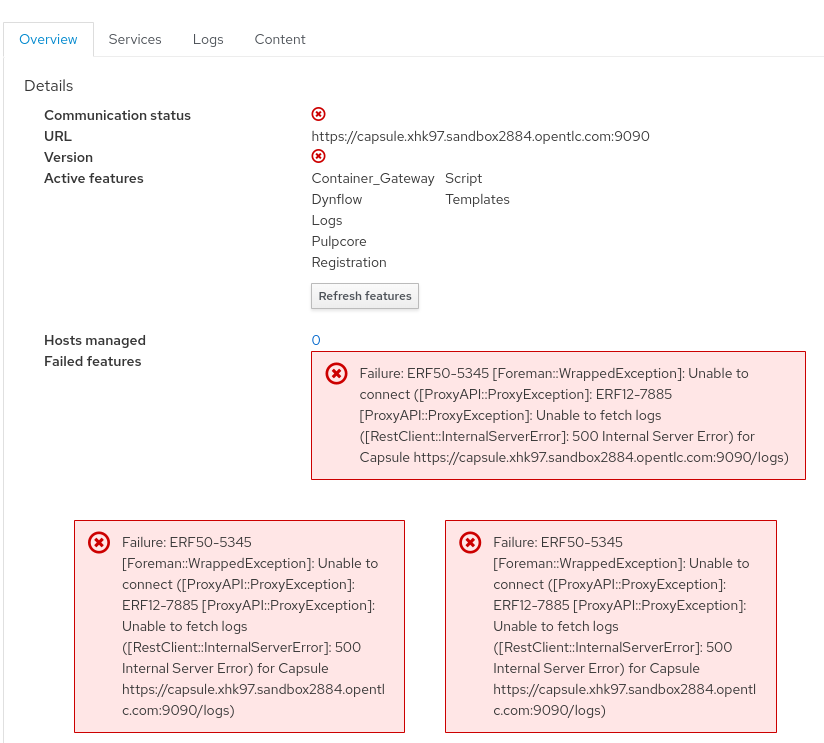
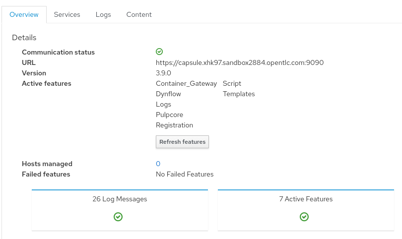

= Module 2 - Troubleshooting Client Connectivity

In this module, we will explore scenarios affecting connectivity between Satellite server, Satellite capsule, client and remote execution. +

== Environment
* `bastion`   - RHEL 9 jump host
* `satellite` - Red Hat Satellite Server 6.15
* `capsule`   - Red Hat Satellite Capsule 6.15
* `node2`     - RHEL 9 client

{empty} +

[#scenario 1]
== Scenario 1: Troubleshoot client registration errors

Connectivity issues prevent clients from accessing Red Hat content including security fixes which is a compliance risk. +
In addition, the client does not benefit from the intelligence provided by Red Hat Insights. +

The objective of this scenario is to investigate and resolve issues that prevent a client from registering with or accessing content from Red Hat Satellite. +

Access the bastion node through the terminal on the right, or using SSH as the `lab-user`.

Run the following command to introduce the registration failure.

[source,sh,role=execute,subs="attributes"]
----
sudo ansible-navigator run --inventory /tmp/hosts --eei quay.io/agnosticd/ee-ubi9-aap2.5:1.0.1 /home/lab-user/rh1-lab19-satellite/Module_2/break_client_registration.yml -m stdout
----

=== Task: Client Registration

* From the `Bastion`, login to `satellite`

[source,sh,role=execute,subs="attributes"]
----
ssh satellite
----

* Generate a global client registration command using the hammer command on the `satellite` below for the `capsule.{subdomain}`:

[source,sh,role=execute,subs="attributes"]
----
sudo hammer host-registration generate-command \
--activation-keys "client_key" \
--insecure true --force true \
--setup-remote-execution false \
--smart-proxy capsule.{subdomain} \
--setup-insights false
----

* On the 2nd terminal, login to `node2` from the `Bastion` and become root using the commands below:

[source,sh,role=execute,subs="attributes"]
----
ssh node2
----

[source,sh,role=execute,subs="attributes"]
----
sudo su -
----

* Paste the global registration command generated by the Satellite to register `node2` to the `satellite` and observe the error:

Output
----
curl: (56) Proxy CONNECT aborted 
----

* Edit the curl command from the global registration command you copied earlier and add the `-v` flag just after the command `curl`. Then run the command again and observe the output:

Output
----
* Uses proxy env variable HTTPS_PROXY == 'http://satellite.{subdomain}:443'
*   Trying 192.168.0.246:443...
* Connected to satellite.{subdomain} (192.168.0.246) port 443 (#0)
* allocate connect buffer!
* Establish HTTP proxy tunnel to satellite.{subdomain}:443
> CONNECT satellite.{subdomain}:443 HTTP/1.1
> Host: satellite.{subdomain}:443
> User-Agent: curl/7.76.1
> Proxy-Connection: Keep-Alive
> 
* Proxy CONNECT aborted
* CONNECT phase completed!
* Closing connection 0
curl: (56) Proxy CONNECT aborted
----

* From the verbose output of the curl command we can see that the client is trying to use the Satellite server as an HTTP proxy for the global registration. As Satellite is not intended to act as an HTTP proxy, this would need to be corrected before the client can register.

* Check the proxy configurations for node2 to determine where this proxy value is set:

[source,sh,role=execute,subs="attributes"]
----
grep -Hi ^proxy /etc/rhsm/rhsm.conf && env | grep -i proxy
----

Output
----
/etc/rhsm/rhsm.conf:proxy_hostname = 
/etc/rhsm/rhsm.conf:proxy_scheme = http
/etc/rhsm/rhsm.conf:proxy_port = 
/etc/rhsm/rhsm.conf:proxy_user =
/etc/rhsm/rhsm.conf:proxy_password =
HTTPS_PROXY=http://satellite.{subdomain}:443
HTTP_PROXY=http://satellite.{subdomain}:80
----

* From the output, you can see that the proxy settings are coming from the `.bashrc` file of the user. Remove these lines from the user's `.bashrc` file manually and attempt the global registration again. Please be sure to unset the environment variable or restart your shell session before trying the global registration command again:

[source,sh,role=execute,subs="attributes"]
----
unset HTTPS_PROXY; unset HTTP_PROXY
----

{empty} +

[#scenario 2]
== Scenario 2: Troubleshoot Remote Execution

Remote execution enables administrators to run tasks simultaneously on multiple hosts using Ansible or shell scripts. +
Failure to execute causes significant disruption, especially in large Red Hat Satellite deployments. +

The objective of this scenario is to investigate and remediate issues preventing remote execution of jobs. +

From the `Bastion`, access the `satellite` node through the terminal on the right, or using SSH and switch to root user.

[source,sh,role=execute,subs="attributes"]
----
ssh satellite
----

[source,sh,role=execute,subs="attributes"]
----
sudo -i
----

=== Task: Remote execution

* On the {workshop_satellite_url}[Satellite server UI], create a Remote execution job to execute on `node2`. +
* Navigate to `Monitor` -> `Jobs` -> `Run job`.

    Job Category: Commands
    Job template: Run Command - Script Default

* Click `Next`

    Target hosts and input: node2
    command: date

* Click `Run on selected hosts`

* Examine the job output. The job fails because the Remote Execution SSH public key used by the Satellite server does not exist on `node2`.

* On `satellite`, create a new global registration command to include the setup of remote execution for the client and run the command on `node2` as root.

[source,sh,role=execute,subs="attributes"]
----
sudo hammer host-registration generate-command \
--activation-keys "client_key" \
--insecure true --force true \
--setup-remote-execution true \
--smart-proxy capsule.{subdomain} \
--setup-insights false
----

* Re-run the Remote Execution job on `node2`. The job should run successfully.

{empty} +

[#scenario 3]
== Scenario 3: Troubleshoot Capsule Connectivity

Capsules servers mirror content from Satellite server, bringing content and Satellite services closer to clients in distinct geographical or logical locations. +
Connectivity issues between Satellite and Capsules can result in corrupt or inconsistent data being served to clients. +

The objective of this scenario is to investigate and remediate issues affecting connectivity between clients and Red Hat Satellite Capsule. +

Access the bastion node through the terminal on the right, or using SSH.

Run the following command to introduce Capsule connectivity failure.

[source,sh,role=execute,subs="attributes"]
----
sudo ansible-navigator run --inventory /tmp/hosts --eei quay.io/agnosticd/ee-ubi9-aap2.5:1.0.1 rh1-lab19-satellite/Module_2/break_client_capsule.yml -m stdout
----

=== Task: Capsule connectivity

* On the Satellite server UI, check the status of the Capsule server. Navigate to `Infrastructure` -> `Capsules`, then click on `capsule.{subdomain}`

* Notice that the Communication status is marked with a red X.

{empty} +

* From `satellite` as the root user, check the certificate exchange with `capsule` using the curl command below. Notice the Capsule features are not listed.

[source,sh,role=execute,subs="attributes"]
----
sudo -i
----

[source,sh,role=execute,subs="attributes"]
----
curl --cert /etc/foreman/client_cert.pem --key /etc/foreman/client_key.pem --cacert /etc/foreman/proxy_ca.pem https://capsule.{subdomain}:9090/features
----

* On `capsule` as the root user, examine the `foreman-proxy` log.

[source,sh,role=execute,subs="attributes"]
----
sudo -i
----

[source,sh,role=execute,subs="attributes"]
----
grep -i '\[E]' /var/log/foreman-proxy/proxy.log
----

Output:

    2024-12-19T21:32:22  [E] <Errno::ENOENT> No such file or directory @ rb_sysopen - /etc/foreman-proxy/foreman_ssl_cert.pem
    2024-12-19T21:32:22  [E] <Errno::ENOENT> No such file or directory @ rb_sysopen - /etc/foreman-proxy/foreman_ssl_cert.pem
    2024-12-19T21:32:22  [E] <Errno::ENOENT> No such file or directory @ rb_sysopen - /etc/foreman-proxy/foreman_ssl_cert.pem

* On `capsule`, inspect the certificates directory. Notice that the `foreman_ssl_cert.pem` certificate file is missing:

[source,sh,role=execute,subs="attributes"]
----
ls -l /etc/foreman-proxy/
----

Output:

    total 20
    -rw-r--r--. 1 root root             0 Dec 20  2023 migration_state
    drwxr-xr-x. 2 root root          4096 Dec 19 21:07 settings.d
    -rw-r-----. 1 root foreman-proxy 3477 Dec 19 21:05 settings.yml
    -r--r-----. 1 root foreman-proxy 2496 Dec 19 21:05 ssl_ca.pem
    -r--r--r--. 1 root foreman-proxy 2175 Dec 19 21:05 ssl_cert.pem
    -r--r-----. 1 root foreman-proxy 3272 Dec 19 21:05 ssl_key.pem

* On `capsule` as root, run `satellite-installer` command.

[source,sh,role=execute,subs="attributes"]
----
satellite-installer --scenario capsule
----

* On `capsule`, restart the `foreman-proxy` service.

[source,sh,role=execute,subs="attributes"]
----
systemctl restart foreman.proxy
----

* On `satellite` as root, check the certificate exchange with the Capsule using the curl command below. This time, the Capsule features are listed.

[source,sh,role=execute,subs="attributes"]
----
curl --cert /etc/foreman/client_cert.pem --key /etc/foreman/client_key.pem --cacert /etc/foreman/proxy_ca.pem https://capsule.{subdomain}:9090/features | python3 -m json.tool
----

Output:

    [
    "container_gateway",
    "dynflow",
    "logs",
    "pulpcore",
    "registration",
    "script",
    "templates"
    ]

* On the Satellite server UI, check the status of the Capsule server. Navigate to `Infrastructure` -> `Capsules`, then click on `capsule.{subdomain}`

* Notice that the Communication status is marked with a green check.

This lab is complete.
